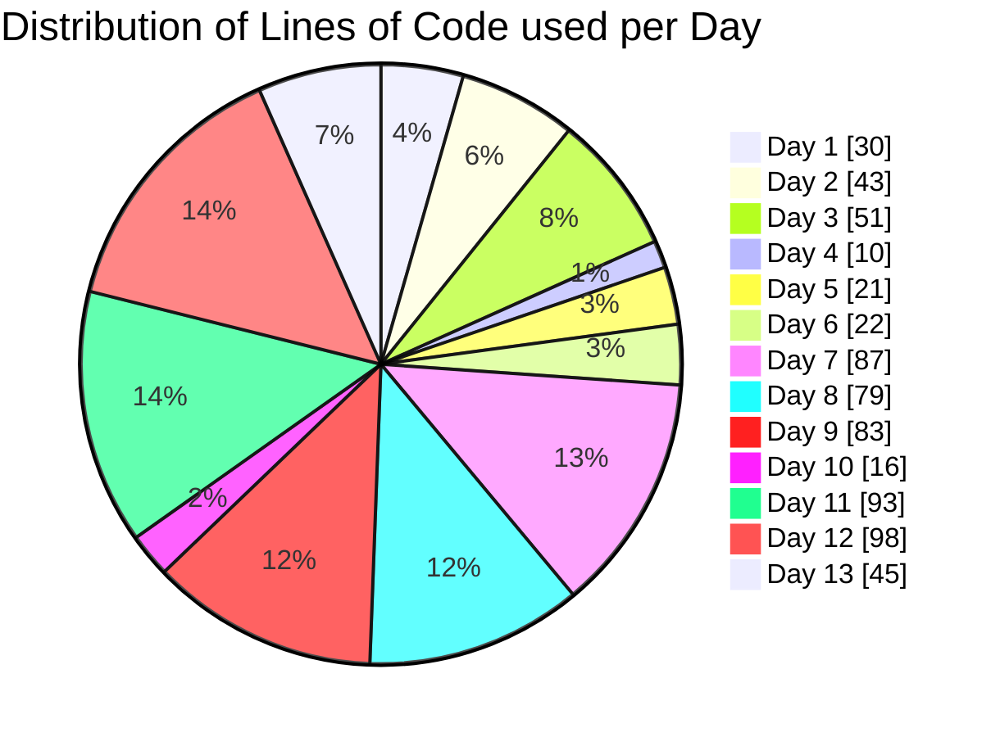

# 🎅 My solutions for [AOC2022](https://adventofcode.com/2022) 🎄

They are intended to be used in the js console of a webbrowser with the input files opened.

(I will make a proper bar chart on the last day 🙂)
(current status: I was part of a database training program in December 2022 and I didn't manage to stick to AoC as it was already pretty intensive. But I might pick it up where I left it as a warmup for AoC 2024!)
